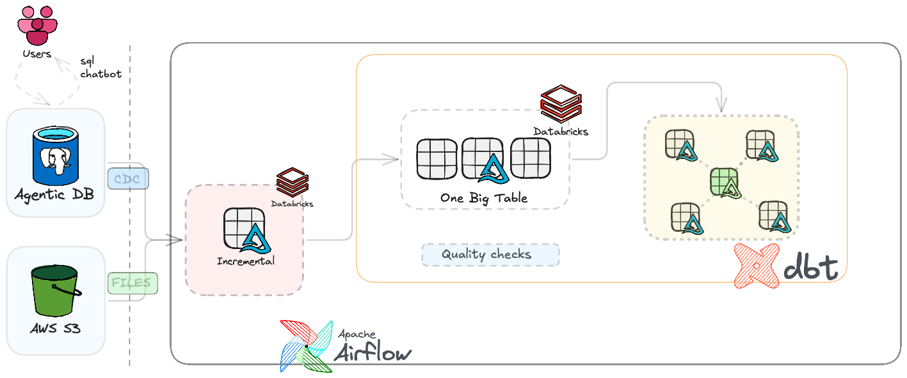
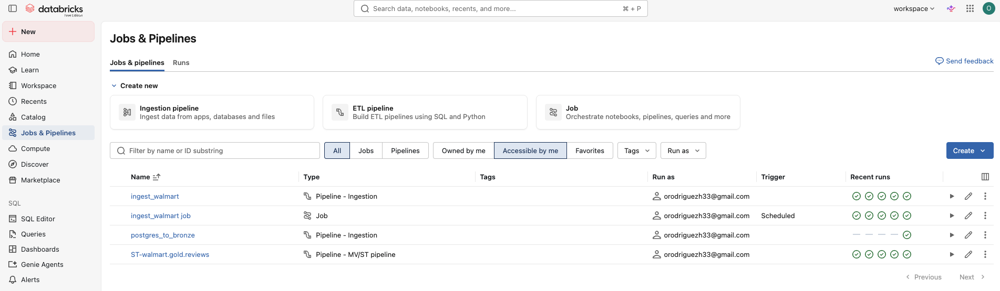
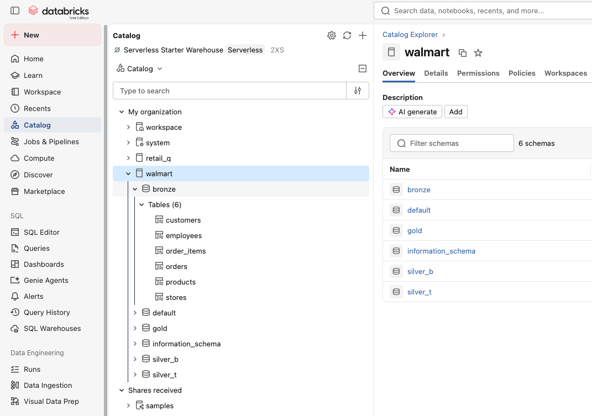
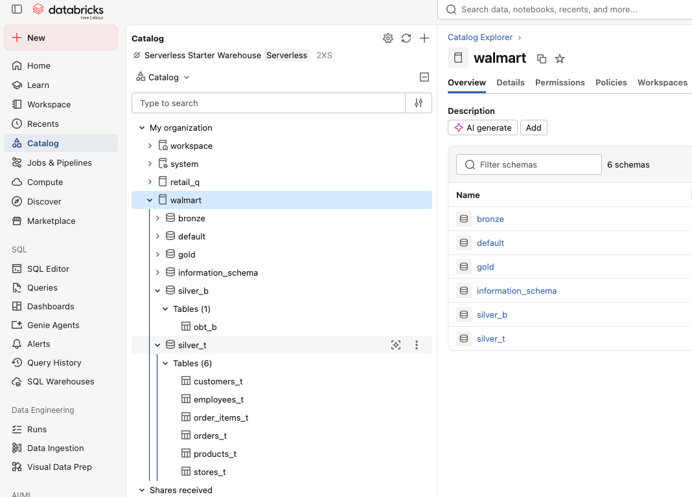
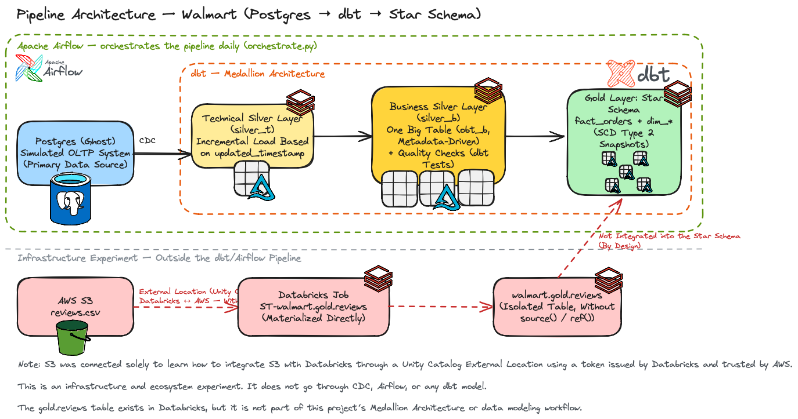
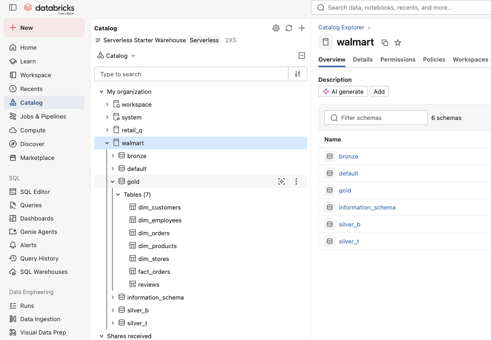
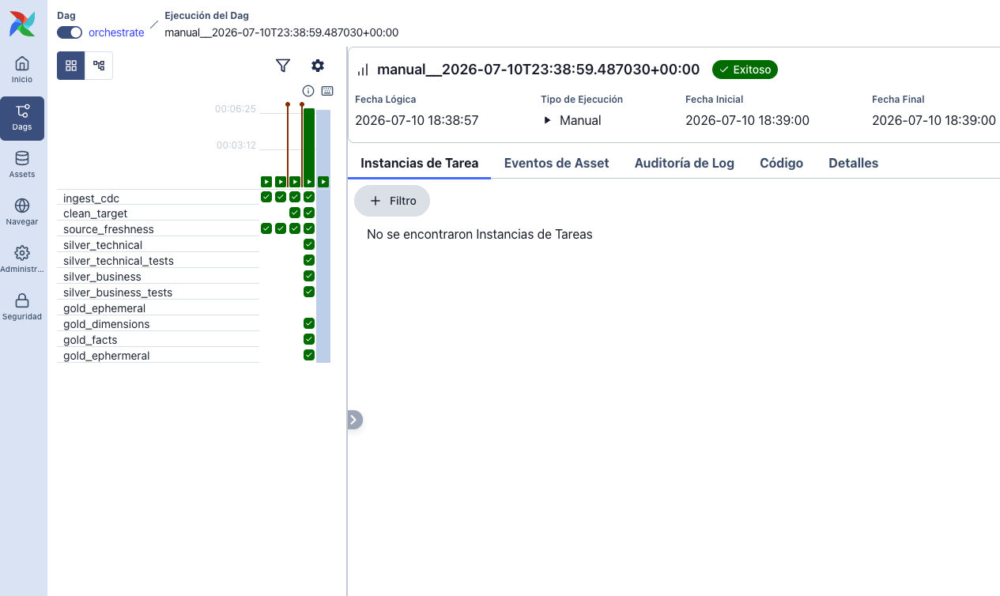

# Walmart Data Platform — from CSVs to an orchestrated Data Warehouse

*[Versión en español](README.es.md)*

End-to-end data pipeline that simulates a real retail chain use case (the "Walmart" dataset): captures operational data, moves it into a Databricks lakehouse via CDC, transforms it with dbt following a medallion architecture, and orchestrates the whole daily process with Airflow in Docker.

This project is actually **two independent repos that connect to each other**:

| Repo                                           | Role                                                                                                        |
| ---------------------------------------------- | ----------------------------------------------------------------------------------------------------------- |
| [`data_project_setup`](../data_project_setup) | Seed ingestion: loads the original CSVs into a Postgres database ("ghost") that acts as the source system.  |
| `data_project_dbt` (this repo)               | Everything that happens next: CDC into Databricks, transformation with dbt, and orchestration with Airflow. |

## Table of contents

- [Why I built it](#why-i-built-it)
- [Architecture](#architecture)
- [Components](#components)
- [Tech stack](#tech-stack)
- [Design decisions (and why they matter)](#design-decisions-and-why-they-matter)
- [What Data Engineering skills this project demonstrates](#what-data-engineering-skills-this-project-demonstrates)
- [Running it locally](#running-it-locally)

## Why I built it

I wanted a project that wasn't "a notebook with a CSV," but something closer to a real production pipeline: an operational source separated from the warehouse, incremental ingestion (not a full reload every time), a layered model with clear responsibilities, automated tests, and an orchestrator that runs on its own every day. The idea was to touch, end to end, the pieces a Data Engineer actually works with: a transactional database, a CDC pipeline, a cloud data warehouse, a transformation framework (dbt), and an orchestrator (Airflow) running in containers — not just the SQL part.

## Architecture


*Overview: the OLTP source (Postgres "ghost") and the external source (S3) reach Databricks through different paths; only the first one goes through dbt/Airflow and lands in the STAR schema.*

## Components

### 1. Seed ingestion — `data_project_setup`

- `walmart_dataset/data/*.csv` — the raw dataset (customers, stores, products, employees, orders, order_items).
- `walmart_dataset/ddl/walmart_schema.sql` — DDL for the destination tables in Postgres.
- `load_data.py` — Python script (`psycopg2`) that runs `COPY ... FROM STDIN WITH CSV HEADER` for each CSV into the `raw` schema of the Postgres database.

This repo is kept **independent** from `data_project_dbt` because it solves a different responsibility: getting the data into the source system, not transforming it. In a real setup this would be the role of an operational system (an ERP, a POS) — here it's simulated with this one-off CSV load.

### 2. The "ghost" database (Postgres) — agentic source system

"ghost" (`db.ghost.build`) isn't a hand-administered Postgres instance — it's an **agentic database**. It was created purely from the DDL (`walmart_dataset/ddl/walmart_schema.sql`) and natural language — an agent read that file and provisioned the database, schema, and tables without anyone running `CREATE DATABASE`/`CREATE TABLE` by hand. Once the schema existed, `load_data.py` (item 1) did the actual CSV ingestion.

Working with an agentic database like Ghost brings advantages a traditional Postgres instance doesn't have natively — for example, **database forking**: you can create a full copy/branch of the database (like a git branch, but for data) to test migrations, seeds, or schema changes without touching the primary instance, then discard it or promote it later ([more detail on agentic databases and forking →](docs/CONCEPTS.md#the-ghost-database-as-an-agentic-database)).

Ghost is the point from which Databricks does **CDC (Change Data Capture)**: instead of reloading the whole dataset every time, the Databricks job only pulls the changes (`INSERT`, `UPDATE`, `DELETE`) since the last run.

### 3. Ingestion into Databricks (Bronze) — the pipeline that ended up in Airflow

That CDC pipeline started as an independent job in Databricks (referenced by `DATABRICKS_INGEST_JOB_ID`) and later became integrated as the first task of the Airflow DAG (`ingest_cdc` in `orchestrate.py`), which triggers it via `WorkspaceClient` and polls its status until it finishes. The job lands the data in the `walmart` catalog, `bronze` schema — the "raw" layer inside the lakehouse, untransformed.


*The CDC job (`postgres_to_bronze`) running in Databricks Workflows, alongside the isolated `ST-walmart.gold.reviews` job from section 5.*


*The 6 source tables already landed in `walmart.bronze`, untransformed.*

### 4. Transformation with dbt — medallion architecture

Everything lives in `airflow/walmart_project/`, targeting Databricks (catalog `walmart`):

1. **Source** (`models/source/sources.yml`) — declares `bronze.orders`, `customers`, `products`, `order_items`, `employees`, `stores`.
2. **Silver technical** (`models/silver_t/`, schema `silver_t`) — one **incremental** model per entity. Each one adds `processed_at` and only processes rows with an `updated_timestamp` newer than what's already loaded (`is_incremental()`), instead of reprocessing the whole table every run.
3. **Silver business** (`models/silver_b/obt_b.sql`, schema `silver_b`) — a "one big table" (OBT) that joins the 6 `silver_t` tables into a single wide model. It's a **metadata-driven pipeline**: the JOIN isn't hand-written per table, it's generated by a Jinja loop over a configuration list (`configs = [{table, columns, alias, join_condition}, ...]`) — adding a new source means adding an entry to that list, not writing new SQL.
4. **Gold ephemeral** (`models/gold/ephemeral/eph_*.sql`) — per-entity slices of `obt_b`. By materializing them as `ephemeral`, dbt never creates a physical table or view in Databricks: at compile time it **inlines them as a CTE** into whatever model references them via `ref()`. It's modularity for free — one file, one responsibility, per entity — without paying the storage/compute cost of a step that only exists to feed the next one.
5. **Gold — SCD2 dimensions** (`snapshots/dim_*.yml`) — dbt snapshots (`strategy: timestamp`) over the `eph_*` models, building historical dimensions (`dim_orders`, `dim_customers`, `dim_products`, `dim_stores`, `dim_employees`). Every time a row changes, dbt closes the previous version (`dbt_valid_to`) and opens a new one (`dbt_valid_from`) automatically — the **Slowly Changing Dimension Type 2** pattern, which by hand means writing (and maintaining) a `MERGE` with change detection, surrogate keys, and concurrency control for each dimension. Here it's the same ~10-line declarative config, applied identically to all 5.
6. **Gold — facts** (`models/gold/fact/fact_orders.sql`) — the fact table at order-line grain, ready for analytical consumption.

Points 4 and 5 are, to me, the strongest argument for using dbt in this project: they turn two classically manual data engineering problems — modularizing transformations without paying a materialization cost, and maintaining SCD2-style history per dimension — into declarative, reusable configuration, instead of hundreds of hand-written and hand-maintained lines of SQL/`MERGE`, one per table. (Full mechanics of both patterns in [docs/CONCEPTS.md](docs/CONCEPTS.md#ephemeral-materialization-gold).)

The dimensions (`dim_*`) plus the fact table (`fact_orders`) form a classic **STAR Schema** in the `gold` layer: `fact_orders` at the center, referencing each `dim_*` by its natural key — the standard model for BI tools (Looker, Power BI, Tableau) to consume the data without having to rebuild complex joins.

A macro (`macros/custom_schema.sql`) overrides dbt's `generate_schema_name` so every model lands exactly in its declared schema (`silver_t`, `silver_b`, `gold`), without dbt's default concatenation.


*The 6 incremental `silver_t` tables and the OBT (`obt_b`) in `silver_b`, already joined.*

### 5. Isolated external ingestion — AWS S3 → Databricks (`gold.reviews`)


*Same map as the "Architecture" section, but with detail on each component and an explicit note that `gold.reviews` is not integrated into the STAR schema, by design.*



The screenshot above shows it live: `reviews` sits in the same `gold` schema as `fact_orders`/`dim_*`, but as a standalone table — no dbt model references it.

The goal of this connection was purely **infrastructure learning**: understanding how to connect S3 to Databricks, not enriching the data model. A product-reviews CSV was uploaded to an **S3** bucket and connected to Databricks via a Unity Catalog **External Location**: Databricks issues the token/credential that AWS trusts to authorize access to the bucket. This connection is completely independent from the main flow (Postgres → CDC) and created a Databricks job (`ST-walmart.gold.reviews`) that materializes the data directly into `walmart.gold.reviews`.

This is an **infrastructure/ecosystem** change (configured in the AWS and Databricks consoles), not a code change: there's no file in this repo that represents it. `gold.reviews` lives **intentionally isolated** — it isn't part of this project's dbt (medallion) modeling and there's no plan to integrate it; if it were ever joined into the STAR schema, that would require writing a dbt model (`source`/`ref`) connecting it to `fact_orders`/`dim_products`.

### 6. Orchestration — Airflow + Docker Compose

`airflow/dags/orchestrate.py` defines a single DAG (`orchestrate`) that chains the whole daily flow:

```text
ingest_cdc → clean_target → source_freshness → silver_technical → silver_technical_tests
  → silver_business → silver_business_tests → gold_ephemeral → gold_dimensions → gold_facts
```


*A full run of the `orchestrate` DAG, all 10 tasks green end to end.*

- `ingest_cdc` triggers and waits on the Databricks job (SDK `WorkspaceClient`, polling every 5s).
- `clean_target` (`@task.bash`) deletes `target/` and `logs/` from the dbt project before every run, so no artifact from a previous execution (manifest, cached compilation) contaminates the current one.
- `source_freshness` runs `dbt source freshness` before transforming, so nothing is built on top of stale source data.
- Each layer (`silver_t`, `silver_b`) runs its `dbt run` followed by its `dbt test`, so the pipeline doesn't move forward if a layer fails validation.
- `gold_dimensions` runs `dbt snapshot --select dim_orders dim_customers dim_products dim_stores dim_employees` to materialize the SCD2 history, instead of an unfiltered `dbt snapshot`.

The whole Airflow stack (webserver, scheduler, dag-processor, worker, triggerer, Postgres, Redis) runs containerized via `docker-compose.yaml` with `CeleryExecutor` — the scheduler enqueues tasks in Redis and one or more workers execute them, instead of running everything in a single process ([how it works →](docs/CONCEPTS.md#airflows-celeryexecutor)).

## Tech stack

- **Orchestration:** Apache Airflow 3.x (CeleryExecutor, Docker Compose)
- **Transformation:** dbt-core + dbt-databricks
- **Warehouse / Lakehouse:** Databricks (catalog `walmart`)
- **Source system:** PostgreSQL
- **Ingestion:** Python (`psycopg2`), Databricks Jobs (CDC)
- **External data lake:** AWS S3, connected to Databricks via External Location (Unity Catalog)
- **Infrastructure:** Docker / Docker Compose
- **Dependency management:** `uv`
- **CI:** GitHub Actions (`.github/workflows/ci.yml`) — `ruff` over `airflow/dags`, `sqlfluff` (dbt templater, against the real Databricks target), and `dbt test`, on every push/PR to `main`.

## Design decisions (and why they matter)

Short summary of each decision — the full mechanics (what problem it solves, what would happen without it, how it works step by step) live in **[docs/CONCEPTS.md](docs/CONCEPTS.md)**.

- **Medallion architecture (bronze → silver → gold):** separates "data as it arrives" from "clean data" from "data ready for business use," isolating which layer broke. → [details](docs/CONCEPTS.md#medallion-architecture-bronze--silver--gold)
- **Incremental models in `silver_t`:** only processes what changed since the last run, not the whole history — the real pattern used in high-volume pipelines. → [details](docs/CONCEPTS.md#incremental-models-in-silver_t)
- **CDC instead of extract-and-replace:** reflects how real operational systems integrate with a warehouse, without hammering the source or moving more data than necessary. → [details](docs/CONCEPTS.md#cdc-instead-of-extract-and-replace)
- **dbt snapshots for dimensions (SCD2):** preserves the history of changes in `customers`/`products`, not just the current state — needed for correct historical analysis. → [details](docs/CONCEPTS.md#dbt-snapshots-for-dimensions-scd2)
- **Jinja-generated OBT (`obt_b`):** metaprogramming in dbt to avoid hand-repeating 6 nearly identical JOIN blocks. → [details](docs/CONCEPTS.md#metadata-driven-obt-with-jinja-silver_b)
- **Tests after every layer, not only at the end:** the DAG fails fast if `silver_t` or `silver_b` don't pass their tests, instead of building `gold` on top of already-invalid data. → [details](docs/CONCEPTS.md#tests-after-every-layer-not-just-at-the-end)
- **Separate repos for ingestion vs. transformation:** each repo has its own responsibility and lifecycle — you can touch ingestion without touching the warehouse, and vice versa.
- **Secrets kept out of the code:** Databricks credentials are read from environment variables injected via `.env` + Docker Compose, never hardcoded in the DAG. → [details](docs/CONCEPTS.md#secrets-kept-out-of-the-code)
- **Direct CDC from OLTP for the main flow, S3 only for external data:** the core dataset doesn't go through a data lake — an OLTP source system is simulated and CDC'd directly into Databricks; S3 is reserved for an external, complementary dataset (reviews) that doesn't originate from any operational system of its own. → [details](docs/CONCEPTS.md#isolated-s3-vs-cdc-for-the-main-flow) / see [Isolated external ingestion](#5-isolated-external-ingestion--aws-s3--databricks-goldreviews).

## What Data Engineering skills this project demonstrates

- **Data modeling:** medallion architecture, OBT, **Slowly Changing Dimensions (SCD2)**, **STAR Schema** (`fact_orders` + `dim_*`) — the patterns used in real warehouses, not just flat tables.
- **dbt in depth:** incremental models, ephemeral models, snapshots, tests, macros, per-folder configuration, **metadata-driven pipeline** (dynamic SQL generation with Jinja from a configuration list, not hand-repeated SQL).
- **Orchestration:** designing a DAG with explicit dependencies, *bash operators* vs. *python tasks*, and a run→test pattern per layer.
- **Systems integration:** moving data between an operational system (Postgres) and a lakehouse (Databricks) via CDC, not just manual loads.
- **Infrastructure as code:** the full Airflow stack reproducible with Docker Compose.
- **Secrets hygiene and version control:** identifying hardcoded credentials, moving them to environment variables, and structuring `.gitignore`/repos so they never end up in git history — a common mistake I learned to catch and fix in this very project.
- **CI/CD:** a GitHub Actions pipeline that runs lint (`ruff`, `sqlfluff` via the dbt templater) and `dbt test` against the real warehouse on every push/PR, instead of relying on the developer remembering to run it locally.

## Running it locally

```bash
# 1. Python dependencies (includes ruff/sqlfluff with --all-groups)
uv sync --all-groups

# 2. Bring up Airflow
cd airflow
cp .env.example .env   # fill in DATABRICKS_HOST, DATABRICKS_TOKEN, DATABRICKS_INGEST_JOB_ID
docker-compose up airflow-init
docker-compose up

# 3. dbt (against the same project Airflow uses) — requires DATABRICKS_TOKEN exported in your local shell
cd walmart_project
export DATABRICKS_TOKEN=<your-token>
dbt run
dbt test

# 4. Lint (what runs in CI)
uv run ruff check airflow/dags
uv run sqlfluff lint airflow/walmart_project/models airflow/walmart_project/snapshots
```

Airflow becomes available at `http://localhost:8080`.
